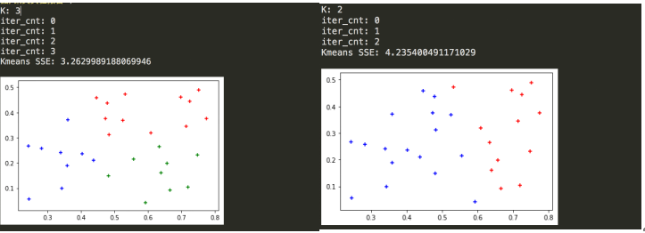
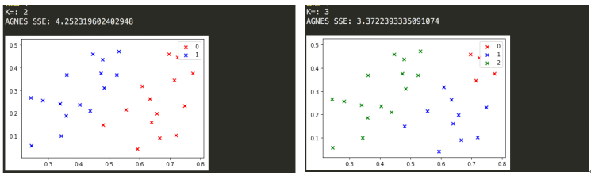
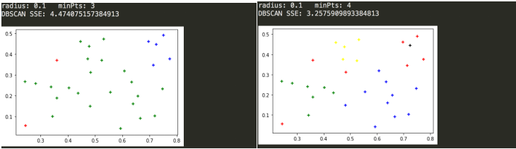

# Clustering
Here is a set of Clustering algorithms. Kmeans, DBSCANS, AGNES are all implemented in Python.

## Introduction
"Clustering" is an experimental project. Through self-study on the principle of decision tree splitting, I finally completed the realization of the following three models, which are implemented in Python. Some suggestions and questions from the experiment were also put forward later.

## Experimental Results
- 1. Kmeans

- 2. AGNES

- 3. DBSCAN

## Experiment Conclusions

- 1) Since the data set used in this experiment is small, SSE is mainly used to measure the rationality of clustering. From the results (experimental screenshots), the best effect is the density clustering algorithm (domain parameter is (0.09, 3)), SSE is 2.8, and the best effect of other methods is only about 3.1. However, from the visual effect point of view, the results obtained by the density clustering method are more scattered, while Kmeans and AGENES are the point distributions of each cluster are more concentrated.
- 2) The following briefly summarizes the advantages and disadvantages of each clustering algorithm. The Kmeans algorithm is simple and efficient, but it is more sensitive to outliers and has the disadvantage of a greedy algorithm. It can also be found from experiments that the density clustering algorithm is not sensitive to noise; it can find clusters of arbitrary shapes, but the clustering results have a great relationship with the parameters; the AGENES algorithm has good interpretability (such as when it is necessary to create a Type classification method); but the time complexity is high, o(m^3), the improved algorithm also has o(m^2lgm), m is the number of points; at the same time, there are also the shortcomings of the greedy algorithm, that is, one step is wrong Wrong step by step. DBSCAN uses fixed parameters to identify clusters, but when the sparseness of the clusters is different, the same criterion may destroy the natural structure of the clusters, that is, the sparse clusters will be divided into multiple clusters or the density is larger and separated. The closer classes will be merged into a cluster.

## Model Improvements & Problems

In summary, the clustering algorithm compares the similarity between data points by distance. The idea of clustering is also embodied in many other algorithms, such as principal component analysis, which is to "merge" similar features together. Of course, before clustering, the data can also undergo a series of processing to make the clustering algorithm more efficient and accurate. The most common processing methods are standardization, normalization, transformation, and dimensionality reduction.